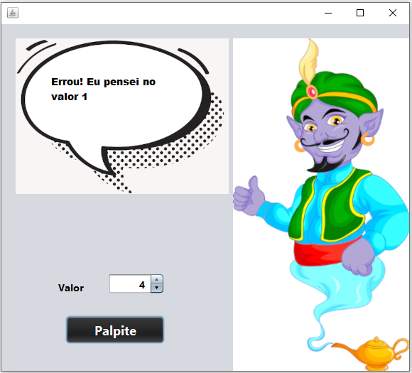
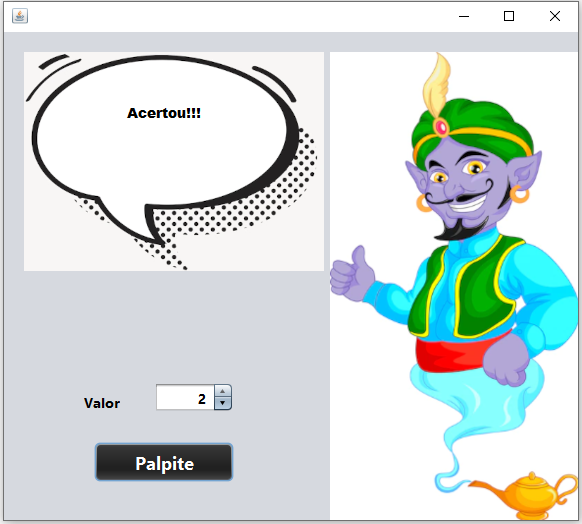

## Código - Leitor de Pensamentos 💭

### Java - Curso em Vídeo ☕▶

Código desenvolvido na aula 8 do Curso em Vídeo - Java, com essa aula consegui elaborar um jogo simples de leitura de pensamentos, o usuário efetua um palpite e a máquina diz se o usuário acertou ou não a resposta.

- [x] O programa vai exibir a interface gráfica do leitor de pensamentos, sendo representada por um gênio e um balão com as interações com o usuário.

### Tela inicial da interface 🔲

  

- [x] Após selecionar o valor desejado entre <strong>1</strong> e <strong>5</strong> e apertar o botão do Palpite, o Gênio vai exibir o resultado do palpite através do balão.

### Tela - tentativa 

  

### Tela - acerto

  

## Tecnologias 🛠

- Java ☕

## Instrutor 👨🏽‍🏫
- <a target="_blank" href="https://www.linkedin.com/in/guanabara/">Gustavo Guanabara</a>

## Aluno 👨🏽‍🎓

- <a target="_blank" href="https://www.linkedin.com/in/ramon-barreto-076191180/">Ramon Barreto</a>

## Contato 📲

- Email: ramon_barreto_medrado@hotmail.com